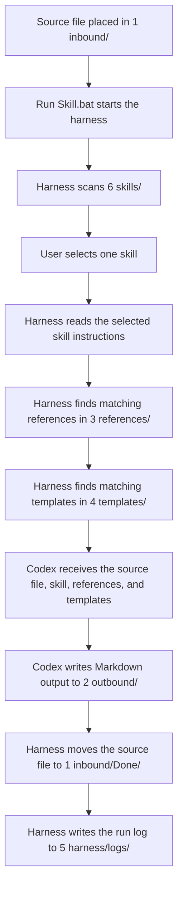

# Control Library

Control Library is a local Codex document workflow.

Link: https://chaddeguzman.github.io/control-library/

It turns source files from `1 inbound/` into structured Markdown documents in `2 outbound/` by combining:

1. The source file
2. The selected skill from `6 skills/`
3. Matching reference guidance from `3 references/`
4. Matching template guidance from `4 templates/`

## Quick Start

1. Put a supported source file in `1 inbound/`.
2. Double click `Run Skill.bat`.
3. Choose a skill from the menu.
4. Review the generated Markdown file in `2 outbound/`.
5. Check `1 inbound/Done/` for the processed original file.
6. Check `5 harness/logs/` for run details.

## Master Workflow

## Folder Guide

| Folder | Status | Purpose |
| --- | --- | --- |
| `1 inbound/` | Local only | Drop zone for files waiting to be processed. |
| `1 inbound/Done/` | Local only | Original source files after successful processing. |
| `2 outbound/` | Local only | Generated Markdown output files. |
| `3 references/` | Synced | Reusable standards, examples, and shared guidance. |
| `4 templates/` | Synced | Gold standard document structures. |
| `5 harness/` | Synced | Runner scripts and local run logs. |
| `6 skills/` | Synced | Markdown skill instructions shown in the menu. |

## Current Skills

| Skill | Purpose |
| --- | --- |
| `TechSpecGen.md` | Creates technical specification documents. |
| `FuncSpecGen.md` | Creates functional specification documents. |

## Matching Logic

The harness uses the selected skill to find related Markdown files in both `3 references/` and `4 templates/`.

Matching considers file name, first heading, `topics`, `applies_to`, and keyword overlap with the selected skill.

## Supported Source Files

`.txt`, `.md`, `.markdown`, `.csv`, `.json`, `.xml`, and `.log` are supported.

Unsupported files stay in `1 inbound/` and are recorded in the run log.

## Runtime Notes

The runner uses `codex exec`. Codex CLI must be installed and authenticated locally.

Each run writes a log file to `5 harness/logs/`.
