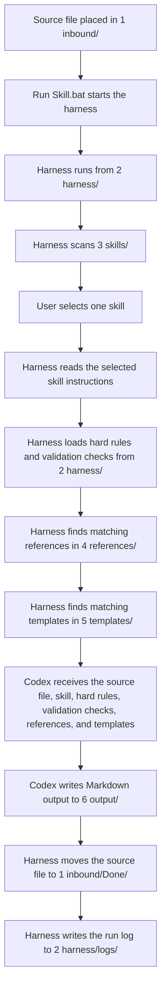

# Control Library

Control Library is a skill-agnostic AI documentation pipeline.

Link: https://chaddeguzman.github.io/control-library/

It receives developer requests or source files from `1 inbound/`, classifies the intent, routes the work to the correct registered skill, and returns a structured Markdown document in `6 output/` by combining:

1. The source file
2. The harness from `2 harness/`
3. The selected skill from `3 skills/`
4. Always-on hard rules and validation checks from `2 harness/`
5. Matching reference guidance from `4 references/`
6. Matching template guidance from `5 templates/`
7. The generated output in `6 output/`

## Core Principles

- **Skill-agnostic pipeline**: the workflow is not tied to one skill, file type, or output type.
- **Intent-based routing**: inbound content is classified and routed to the registered skill that best fits the request.
- **Standardized outputs**: skills, references, templates, hard rules, and validation checks work together to keep outputs consistent and repeatable.
- **Layer independence**: new skills can be added without changing references, templates, hard rules, validation checks, or existing skill behavior.

## Quick Start

1. Put a supported source file in `1 inbound/`.
2. Double click `Run Skill.bat`.
3. Choose a skill from the menu.
4. Review the generated Markdown file in `6 output/`.
5. Check `1 inbound/Done/` for the processed original file.
6. Check `2 harness/logs/` for run details.

## Master Workflow



## Folder Guide

| Folder | Type | Purpose |
| --- | --- | --- |
| `1 inbound/` | Local only | Drop zone for files waiting to be processed. |
| `1 inbound/Done/` | Local only | Original source files after successful processing. |
| `2 harness/` | Shared Library | Runner scripts and local run logs. |
| `2 harness/hard rules/` | Shared Library | Always-on rules loaded after skill selection. |
| `2 harness/validation checks/` | Shared Library | Always-on output checks loaded after skill selection. |
| `3 skills/` | Shared Library | Markdown skill instructions shown in the menu. |
| `4 references/` | Shared Library | Reusable standards, examples, and shared guidance. |
| `5 templates/` | Shared Library | Gold standard document structures. |
| `6 output/` | Local only | Generated Markdown output files. |

## Local Only vs Shared Library

Control Library separates working files from reusable system files.

**Local only** folders are part of the user's workspace. They contain source files, generated output, processed originals, or run logs. These files are usually different for every user and every run, so they should stay on the local machine.

**Shared Library** folders are part of the reusable Control Library system. They contain the rules, templates, scripts, and skills that make the workflow repeatable. These files are safe to keep in the repository because they define how the library works.

In simple terms:

| Type | Meaning | Examples |
| --- | --- | --- |
| Local only | Files used or created during a run | `1 inbound/`, `1 inbound/Done/`, `6 output/`, `2 harness/logs/` |
| Shared Library | Reusable system files that guide every run | `2 harness/`, `2 harness/hard rules/`, `2 harness/validation checks/`, `3 skills/`, `4 references/`, `5 templates/` |

## Always-On Rules

Files in `2 harness/hard rules/` and `2 harness/validation checks/` are loaded after the user chooses a skill.

Use `2 harness/hard rules/` for instructions that must always be followed. Use `2 harness/validation checks/` for quality gates Codex should check before writing the final Markdown.

Supported always-on rule files are `.md`, `.markdown`, and `.txt`.

## Current Skills

| Skill | Purpose |
| --- | --- |
| `TechSpecGen.md` | Creates technical specification documents. |
| `FuncSpecGen.md` | Creates functional specification documents. |
| `CreateSkill.MD` | Starts an interactive wizard that creates a new `.md` skill in `3 skills/`. |

## Matching Logic

The harness uses the selected skill to find related Markdown files in `4 references/`.

For `5 templates/`, the harness compares each inbound file name and content against template file names, first headings, `topics`, and `applies_to`. Source-specific template matches are preferred, so a Reports inbound file can select a Reports template while a Smartform inbound file can select a Smartform template. If no source-specific template is found, the harness can fall back to skill-level template matches.

## Supported Source Files

`.txt`, `.md`, `.markdown`, `.csv`, `.json`, `.xml`, and `.log` are supported.

Unsupported files stay in `1 inbound/` and are recorded in the run log.

## Runtime Notes

The runner uses `codex exec`. Codex CLI must be installed and authenticated locally.

To validate the workflow without Codex CLI or output generation, run:

```powershell
.\Run Skill.bat -DryRun
```

Dry run checks the selected skill, always-on rules, validation checks, matching references, matching templates, and pending inbound files without creating output or moving source files.

Each run writes a log file to `2 harness/logs/`.
