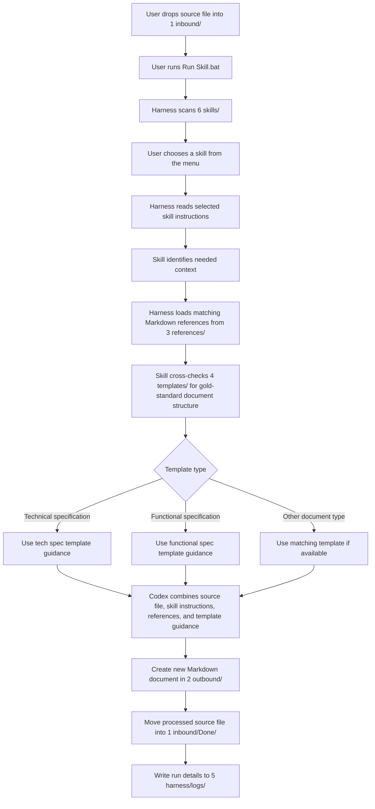

# Control Library

Control Library is a local document workflow that applies reusable Codex skills to files dropped into an inbound folder.

## Quick Start

1. Put source files in `1 inbound/`.
2. Double-click `Run Skill.bat`.
3. Choose a skill from the numbered menu.
4. Review generated Markdown files in `2 outbound/`.
5. Successfully processed source files move to `1 inbound/Done/`.

## Master Workflow



The Control Library separates the workflow into reusable layers:

1. `1 inbound/` holds the user's source files.
2. `6 skills/` defines what kind of work Codex should perform, such as technical specification generation, functional specification generation, or peer review.
3. `3 references/` supplies shared context, standards, examples, coding practices, and review guidance that matching skills can reuse.
4. `4 templates/` stores gold-standard output examples or structures, such as ideal technical specs and functional specs.
5. `2 outbound/` receives the newly generated Markdown document based on the source file, selected skill, matched references, and template guidance.
6. `1 inbound/Done/` stores successfully processed original source files.

## GitHub Workflow

This repository is structured so the reusable library can be pushed and pulled safely while local work files stay on each machine.

Commit and share:

- `3 references/` for reusable guidance, standards, examples, and context.
- `4 templates/` for reusable gold-standard output templates.
- `5 harness/` for runner scripts.
- `6 skills/` for reusable Markdown skill instructions.
- `README.md`, `Run Skill.bat`, and repository config files.

Do not commit:

- Files dropped into `1 inbound/`.
- Generated files in `2 outbound/`.
- Processed originals in `1 inbound/Done/`.
- Runtime logs in `5 harness/logs/`.

Initial GitHub setup from this folder:

```powershell
git init
git add .
git commit -m "Initial control library"
git branch -M main
git remote add origin https://github.com/<owner>/<repo>.git
git push -u origin main
```

Daily sync:

```powershell
git pull --rebase
git add 3 references 4 templates 5 harness 6 skills README.md "Run Skill.bat"
git commit -m "Update library content"
git push
```

## Supported Files

The first version is intended for text-readable files:

- `.txt`
- `.md`
- `.markdown`
- `.csv`
- `.json`
- `.xml`
- `.log`

Unsupported files are left in `1 inbound/` and recorded in the run log.

## Folder Guide

- `1 inbound/` stores files waiting to be processed.
- `1 inbound/Done/` stores original files after successful Markdown creation.
- `2 outbound/` stores generated Markdown files.
- `3 references/` stores shared Markdown reference materials used by skills.
- `4 templates/` stores gold-standard Markdown output templates for documents such as technical specifications and functional specifications.
- `5 harness/` stores runner scripts and logs.
- `6 skills/` stores reusable Markdown skill instructions.

## Adding Skills

Create a `.md` file in `6 skills/`. The file should describe exactly how Codex should transform the inbound source file.

Current skills:

- `TechSpecGen.md` creates technical specification documents.
- `FuncSpecGen.md` creates functional specification documents.

Example skill:

```markdown
# TechSpecGen

Generate a technical specification Markdown document from the inbound source file.
```

The next time you run `Run Skill.bat`, the new skill appears in the menu.

## Adding References

Use `3 references/` as the main holder of reusable context, standards, examples, and best practices. Keep skills task-focused, and put durable guidance in reference Markdown files.

The runner automatically includes matching `.md` and `.markdown` reference files when a skill runs. Matching uses the selected skill name and instructions against each reference file's name, first heading, and optional front matter.

Example reference files:

- `3 references/Peer Review.md`
- `3 references/Coding Best Practices.md`
- `3 references/Review Checklist.md`

For predictable matching, add lightweight metadata at the top of a reference file:

```markdown
---
topics: peer-review, code-review, coding-best-practices
applies_to: PeerReview
---

# Peer Review

Review guidance and coding standards go here.
```

Use `applies_to` when a reference should be tied to a specific skill. Use `topics` for broader matching across related skills.

## Runtime Notes

The runner uses `codex exec`, so Codex CLI must be installed, authenticated, and able to reach its provider endpoints. Each run writes a log file to `5 harness/logs/`.
