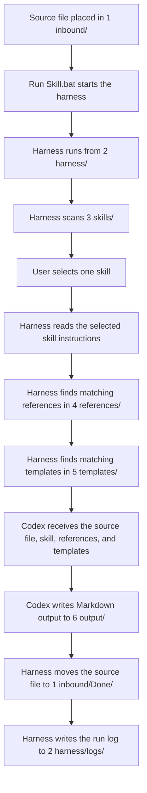

# Control Library

Control Library is a local Codex document workflow.

Link: https://chaddeguzman.github.io/control-library/

It turns source files from `1 inbound/` into structured Markdown documents in `6 output/` by combining:

1. The source file
2. The harness from `2 harness/`
3. The selected skill from `3 skills/`
4. Matching reference guidance from `4 references/`
5. Matching template guidance from `5 templates/`
6. The generated output in `6 output/`

## Quick Start

1. Put a supported source file in `1 inbound/`.
2. Double click `Run Skill.bat`.
3. Choose a skill from the menu.
4. Review the generated Markdown file in `6 output/`.
5. Check `1 inbound/Done/` for the processed original file.
6. Check `2 harness/logs/` for run details.

## Master Workflow

## Folder Guide

| Folder | Type | Purpose |
| --- | --- | --- |
| `1 inbound/` | Local only | Drop zone for files waiting to be processed. |
| `1 inbound/Done/` | Local only | Original source files after successful processing. |
| `2 harness/` | Shared Library | Runner scripts and local run logs. |
| `3 skills/` | Shared Library | Markdown skill instructions shown in the menu. |
| `4 references/` | Shared Library | Reusable standards, examples, and shared guidance. |
| `5 templates/` | Shared Library | Gold standard document structures. |
| `6 output/` | Local only | Generated Markdown output files. |

## Local Only vs Shared Library

Control Library separates working files from reusable system files.

**Local only** folders are part of the user's workspace. They contain source files, generated output, processed originals, or run logs. These files are usually different for every user and every run, so they should stay on the local machine.

**Shared Library** folders are part of the reusable Control Library system. They contain the rules, templates, scripts, and skills that make the workflow repeatable. These files are safe to keep in the repository because they define how the library works.

In simple terms:

| Type | Meaning | Examples |
| --- | --- | --- |
| Local only | Files used or created during a run | `1 inbound/`, `1 inbound/Done/`, `6 output/`, `2 harness/logs/` |
| Shared Library | Reusable system files that guide every run | `2 harness/`, `3 skills/`, `4 references/`, `5 templates/` |

## Current Skills

| Skill | Purpose |
| --- | --- |
| `TechSpecGen.md` | Creates technical specification documents. |
| `FuncSpecGen.md` | Creates functional specification documents. |

## Matching Logic

The harness uses the selected skill to find related Markdown files in both `4 references/` and `5 templates/`.

Matching considers file name, first heading, `topics`, `applies_to`, and keyword overlap with the selected skill.

## Supported Source Files

`.txt`, `.md`, `.markdown`, `.csv`, `.json`, `.xml`, and `.log` are supported.

Unsupported files stay in `1 inbound/` and are recorded in the run log.

## Runtime Notes

The runner uses `codex exec`. Codex CLI must be installed and authenticated locally.

Each run writes a log file to `2 harness/logs/`.
